# Architecture Documentation

**Repository:** [pranavpalekar/aes-password-manager](https://github.com/pranavpalekar/aes-password-manager)

## System Architecture

```mermaid
graph TB
    classDef client fill:#e1f5ff,stroke:#01579b,stroke-width:2px
    classDef server fill:#fff3e0,stroke:#e65100,stroke-width:2px
    classDef database fill:#f3e5f5,stroke:#4a148c,stroke-width:2px
    
    C0["🖥️ Frontend<br/><small>Web Client</small>"]
    C1["⚙️ Backend API<br/><small>Server</small>"]
    C2["🗄️ Database<br/><small>Data Store</small>"]
    
    class C0 client
    class C1 server
    class C2 database
    
    C0 --> C1
    C1 --> C2
```

## Components

- **🖥️ Frontend**: User interface and client-side logic
- **⚙️ Backend API**: Server-side processing and business logic
- **🗄️ Database**: Data persistence layer

## Data Flow

---

*Note: This is a high-level architecture diagram. For detailed implementation, please refer to the source code.*

<!-- Updated: 2025-11-27 12:09:24 -->
